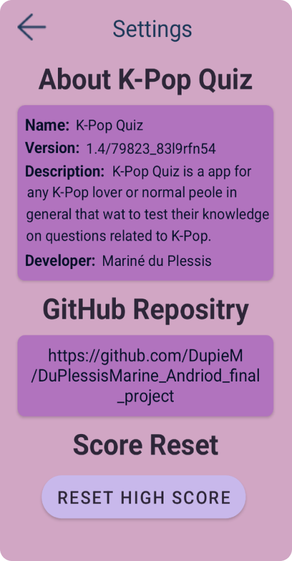

<!-- HEADER SECTION -->
<h5 align="center" style="padding:0;margin:0;">Mariné du Plessis</h5>
<h5 align="center" style="padding:0;margin:0;">221326</h5>
<h6 align="center">Android Introduction 203</h6>
 

  
  
  <h3 align="center">K-Pop Quiz</h3>

### Quiz App Description
Answer fun or interesting K-Pop questions to test your knowledge on K-Pop.
Prove your knowledge on K-Pop by answering the questions in each category in this quiz.
You can choose between 3 categories to test your knowledge on K-pop namely Songs, Groups & General.

RANKING
Compete against players from all over the world and see how your score is ranked at anytime you can reset your score!

## Screens
### Home - Enter Username

### Category

### General - Song - Group Questions

### Result

### Settings

### Video Demonstration

To see a run through of the application, click below:

[View Demonstration](https://drive.google.com/file/d/1ThsQupO0YcAlVHCa5L4YHorXyD3M4nbs/view?usp=sharing)